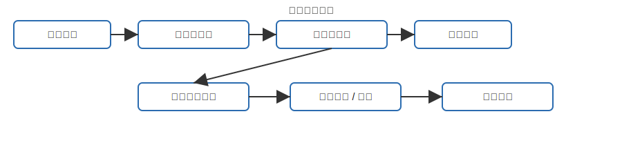
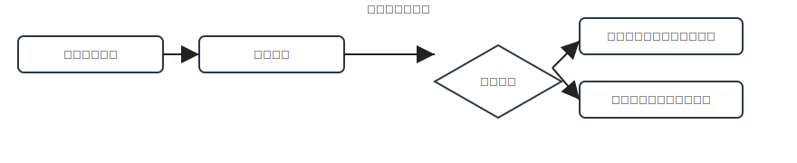
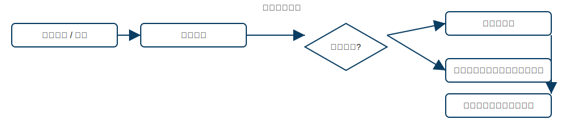
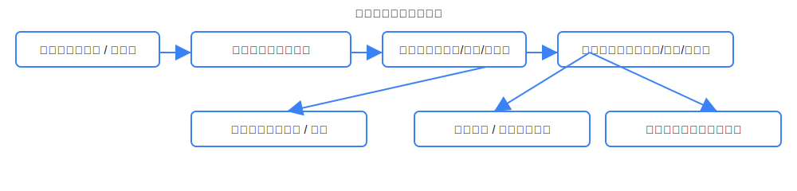
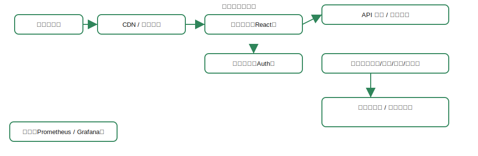

# 医院信息系统（HIS）文档

> 本文档为前端工程的技术文档与功能文档，适合直接用作 PPT 内容或项目说明书摘要。

---

## 📌 概要

- **项目**：HIS 前端（React + TypeScript + Vite）
- **仓库结构（重点）**：
  - 页面：`src/pages/*`（`DoctorStation`、`NurseStation`、`PharmacyStation`、`Admin`、`Login`）
  - 通用组件：`src/components/*`
  - 服务：`src/services/*`（`api.ts`、`authStorage.ts`、`logger.ts`）
  - 状态：`src/store/store.ts`

---

## 🔧 技术文档（Technical Spec）

### 1. 技术栈

- 前端：**React + TypeScript + Vite**
- 样式：PostCSS
- 状态：项目内置 `store`（详见 `src/store/store.ts`）
- 网络：封装 API (`src/services/api.ts`)，鉴权管理 (`src/services/authStorage.ts`)
- 工具：ESLint、Jest（推荐）、Cypress（建议）

### 2. 系统架构

- 浏览器 → CDN（可选） → 前端应用 → API Gateway → 后端微服务 → 数据库
- 建议：使用 Docker + Kubernetes 部署、CI/CD（GitHub Actions）

### 3. 接口示例

- POST `/api/auth/login` → 返回 `accessToken`、`refreshToken`
- POST `/api/charges` → 创建收费单
- PUT `/api/charges/:id/status` → 修改收费单状态（`settle` / `refund`）

### 4. 数据模型（示例）

- Patient { id, name, dob, sex, contacts }
- Charge { id, patientId, items[], total, status, createdBy }

### 5. 安全 & 合规

- 鉴权：JWT + Refresh Token
- 传输：HTTPS 强制
- 前端存储：使用 `authStorage` 封装，避免明文 localStorage
- 审计：关键操作上报日志（`logger.ts`）

### 6. 非功能需求

- 可用性：示例 99.9%
- 响应时间：关键 API < 500ms
- 并发与扩展：根据医院规模设定

### 7. 运维建议

- 监控：Prometheus + Grafana
- 日志：集中化（ELK/EFK）
- 备份：数据库与关键配置定期备份

---

## 🧩 功能文档（Functional Spec）

### 登录模块

- 功能：账号登录、角色切换、错误提示
- 验收：正确凭证完成跳转；错误有明确提示；支持超时/刷新策略

### 医生工作台

- 功能：查看病人、开医嘱、查看检验结果
- 验收：医嘱能正确提交并在后端生成记录

### 护士 — 收费管理（`src/pages/NurseStation/ChargeManagement.tsx`）

- 功能：创建/编辑/删除收费项、计算合计、折扣、结算、退款、打印发票
- 验收：创建后为“未结算”，结算后状态变为“已结算”，后端记账

### 药房工作台

- 功能：处方列表、配药、库存扣减、发药日志
- 验收：配药成功后库存正确更新，低库存触发预警

### 管理后台

- 功能：用户与权限管理、报表导出、系统配置
- 验收：角色权限生效、报表数据准确

## 实现目标

- 实现基础前端功能模块：登录、医生、护士（收费）、药房、管理后台
- 完成前后端基本交互（API 封装、鉴权）并保证演示可运行
- 提交代码与项目文档，并在课堂展示中完成 10 分钟演示

## 测试结果摘要

- 单元测试：已覆盖组件/工具函数（如有）——请在 `package.json` 中补充测试脚本并运行 `pnpm test`
- 手动测试：登录、护士收费、结算流程已通过本地手动验证
- 性能：页面响应良好；未做大规模并发压测（建议写入后续改进）

## 已完成 / 未完成 清单

- 已完成：
  - 登录、护士收费 UI、收费计算逻辑、基础 API 封装、路由守卫
  - 代码结构与部分单元测试（如有）
- 未完成（可作为加分项）：
  - 完整 E2E 测试覆盖（Cypress）、更完善的权限细粒度控制
  - 打印/导出样式优化、发票 PDF 模板完善、打印适配
  - 后端事务一致性/并发场景的自动化测试

## 评分标准（建议给老师参考）

1. 功能实现（50%）：主要功能是否能按要求演示（登录、收费、结算、配药）
2. 代码质量（20%）：结构清晰、注释、类型使用、错误处理
3. 文档与演示（15%）：文档完整、演示有条理、时间控制
4. 测试与可靠性（10%）：单元测试、手动测试覆盖、异常处理
5. 创新与扩展（5%）：额外功能或优化（低配高可用方案、监控、CI）

## 逐页演示稿（简短讲稿 / 提示词）

- Slide 1：标题页
  - 「各位老师、同学好，我们的项目是基于 React 的院内 HIS 前端，主要实现了护士收费、药房、医生工作台与管理后台的基础功能。」
- Slide 2：项目概述
  - 「目标是构建可演示的院内前端系统，采用 React + TypeScript + Vite，提高开发效率并便于扩展。」
- Slide 3：关键业务流程
  - 「这里以收费流程为例，演示从建单到结算的完整闭环。」
- Slide 4：技术架构
  - 「前端采用组件化、封装了 API 与鉴权，建议部署于 CDN + 前端主机，后端使用微服务。」
- Slide 5：演示（现场演示页面）
  - 现场演示护士收费：新建收费单 → 添加项目 → 结算 → 查看账目
- Slide 6：测试与已知问题
  - 「列出已通过测试与若干未完成项，并说明未来计划。」
- Slide 7：结论与答疑
  - 「总结实现要点、收获与后续改进计划，欢迎提问。」

## 参考文献与致谢

- React 文档、TypeScript 指南、Vite 官方文档
- 本项目中使用的开源库

---

## 流程图（附图）
下面附上常用流程图（SVG 文件位于 `docs/diagrams/`），可直接在 PPT 中嵌入或打印：

### 护士收费流程

> 描述：从选择病人到生成发票并记账的完整闭环，适合作为课堂演示的主流程。

### 登录与权限流程

> 描述：展示前端登录、凭证验证、角色加载与导航的流程。

### 药房配药流程

> 描述：从接收处方到配药出库、库存更新与异常处理的流程。

### 医生病历与开医嘱流程

> 描述：医生查看病人信息、查看检验结果、开立医嘱并下发到药房或检查科室。

### 部署架构示意图

> 描述：前端托管、API 网关、鉴权服务、微服务与数据库的高层次示意。

---

**提交说明**：本文件作为课程作业说明文档，可直接用于课堂展示或作为提交材料，若需我把该文档转为 PPT（含每页讲稿）请回复“生成 PPT”。

**文件位置**：`docs/HIS_spec.md` (课程作业版)
