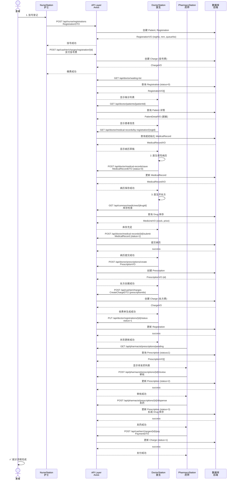

# HIS系统完整业务流程图

## 挂号→看诊→病历→处方 业务流程与数据关联

```mermaid
graph TD
    A["👤 患者来院<br/>检查是否老患者"] -->|新患者| B["📋 护士站录入<br/>患者基本信息<br/>建立 Patient 档案"]
    A -->|老患者| C["🔍 身份证验证<br/>自动填充患者信息"]
    
    B --> D["💳 挂号表单<br/>选择科室、医生、医保"]
    C --> D
    
    D --> E["💰 生成RegistrationDTO<br/>患者名/身份证/年龄/电话<br/>科室ID/医生ID/挂号费"]
    E --> F["📊 POST /api/nurse/registrations<br/>创建Registration记录<br/>registrationApi.create()"]
    
    F --> G["💵 支付挂号费<br/>POST /api/cashier/charges/registration/{id}<br/>chargeApi.createRegistrationCharge()"]
    
    G --> H["📌 RegistrationVO 生成<br/>regNo = REG2025xxx<br/>mrn = P2025xxx<br/>status = 0 待就诊<br/>queueNo = A001"]
    
    H --> I["🏥 医生工作台<br/>GET /api/doctor/waiting-list<br/>显示候诊列表"]
    
    I --> J["👆 医生点击患者<br/>开始就诊"]
    
    J --> K["📂 加载患者信息<br/>GET /api/doctor/patients/{patientId}<br/>获取 PatientDetailVO"]
    
    J --> L["📖 加载/新建病历<br/>GET /api/doctor/medical-records/by-registration/{regId}<br/>获取或初始化 MedicalRecordDTO"]
    
    K --> M["📝 医生填写病历<br/>主诉、现病史、诊断<br/>体格检查、医嘱<br/>medical_record.status = 0 草稿"]
    L --> M
    
    M --> N["💾 保存草稿<br/>POST /api/doctor/medical-records/save<br/>doctorApi.saveMedicalRecord()"]
    
    N --> O["✅ 病历保存成功<br/>MedicalRecordVO 返回<br/>包含 mainId、recordNo"]
    
    O --> P["💊 医生开处方<br/>选择药品、用量、用法<br/>计算 totalAmount"]
    
    P --> Q["🔄 库存检查<br/>GET /api/common/medicines/{id}<br/>检查每项药品库存<br/>pharmacyApi.getMedicineDetail()"]
    
    Q -->|库存充足| R["📋 处方构建<br/>PrescriptionVO<br/>patientName, gender, age<br/>regNo, totalAmount<br/>items: [drugName, spec, count, usage]"]
    Q -->|库存不足| S["⚠️ 提示用户库存不足<br/>操作中断"]
    
    R --> T["🚀 提交病历并发送处方<br/>Step 1: 保存病历 status=1 已提交<br/>doctorApi.saveMedicalRecord()"]
    
    T --> U["Step 2: 提交病历<br/>POST /api/doctor/medical-records/{id}/submit<br/>doctorApi.submitMedicalRecord()"]
    
    U --> V["Step 3: 发送处方至药房<br/>POST /api/doctor/prescriptions/create<br/>pharmacyApi.sendPrescription()"]
    
    V --> W["✨ 处方创建成功<br/>返回 PrescriptionVO<br/>prescription.id 获得"]
    
    W --> X["Step 4: 生成收费单<br/>POST /api/cashier/charges<br/>chargeApi.create<br/>registrationId + prescriptionIds"]
    
    X --> Y["📊 收费单生成<br/>ChargeVO<br/>status = 0 未支付<br/>totalAmount = 处方费用"]
    
    Y --> Z["🏥 药房工作台<br/>GET /api/pharmacist/prescriptions/pending<br/>显示待发药列表"]
    
    Z --> AA["✅ 审核处方<br/>POST /api/pharmacist/prescriptions/{id}/review<br/>pharmacyApi.reviewPrescription()"]
    
    AA --> AB["💊 发药操作<br/>POST /api/pharmacist/prescriptions/{id}/dispense<br/>pharmacyApi.dispense()"]
    
    AB --> AC["📉 库存自动扣减<br/>stock -= count<br/>更新 Drug 库存"]
    
    AC --> AD["💳 收费站确认支付<br/>POST /api/cashier/charges/{id}/pay<br/>chargeApi.pay()"]
    
    AD --> AE["✅ 就诊流程完成<br/>Patient → Registration → MedicalRecord → Prescription<br/>全链路跟踪完成"]
    
    S -.不通过.-> E
    
    style A fill:#e1f5ff
    style B fill:#fff3e0
    style F fill:#f3e5f5
    style H fill:#e8f5e9
    style I fill:#fce4ec
    style M fill:#fff8e1
    style O fill:#e0f2f1
    style P fill:#f1f8e9
    style V fill:#ede7f6
    style W fill:#c8e6c9
    style Z fill:#ffecb3
    style AB fill:#ffccbc
    style AE fill:#c8e6c9,color:#000,font-weight:bold
```



---

## 数据关联映射表

| 阶段 | 主要数据模型 | 关键字段 | API 端点 | 状态转换 |
|------|-----------|---------|---------|---------|
| **1. 挂号** | `Patient` (新建) | patient_no, name, id_card, age, phone | `POST /api/nurse/registrations` | N/A → 已创建 |
| **2. 挂号** | `Registration` | reg_no, patient_id, doctor_id, dept_id, reg_fee, status=0 | `POST /api/nurse/registrations` | 0 待就诊 |
| **3. 收费** | `Charge` (挂号费) | charge_no, reg_id, fee=20, status=0 | `POST /api/cashier/charges/registration/{id}` | 0 未支付 |
| **4. 候诊** | `RegistrationVO` | queueNo, mrn, statusDesc | `GET /api/doctor/waiting-list` | status=0 待诊 |
| **5. 就诊** | `PatientDetailVO` | 患者完整信息 (脱敏) | `GET /api/doctor/patients/{id}` | 查询只读 |
| **6. 病历** | `MedicalRecord` | registration_id, patient_id, doctor_id | `POST /api/doctor/medical-records/save` | status=0 草稿 |
| **7. 病历** | `MedicalRecord` (更新) | 同上 + diagnosis, doctor_advice | `POST /api/doctor/medical-records/{id}/submit` | status=1 已提交 |
| **8. 处方** | `Prescription` | registration_id, patient_id, doctor_id | `POST /api/doctor/prescriptions/create` | status=0 草稿 |
| **9. 收费** | `Charge` (处方费) | charge_no, prescription_id, total_amount | `POST /api/cashier/charges` | status=0 未支付 |
| **10. 审核** | `Prescription` (更新) | 同上 | `POST /api/pharmacist/prescriptions/{id}/review` | status=2 已审核 |
| **11. 发药** | `Prescription` (更新) | 同上 + dispense_time | `POST /api/pharmacist/prescriptions/{id}/dispense` | status=3 已发药 |
| **12. 发药** | `Drug` (库存减少) | stock -= count | (自动) | stock 更新 |
| **13. 支付** | `Charge` (支付) | 同上 + payment_method, transaction_no | `POST /api/cashier/charges/{id}/pay` | status=1 已支付 |

---

## 关键数据流向图

```
┌─────────────────┐
│    患者来院      │
└────────┬────────┘
         │
         ▼
   ┌──────────────┐
   │ Patient      │  (patient_no, name, id_card, age, phone)
   │ 新建/查询    │
   └─────┬────────┘
         │
         ▼
   ┌──────────────────────┐
   │ Registration         │  (reg_no, patient_id, doctor_id, dept_id, regFee, status=0)
   │ 挂号记录创建         │
   └─────┬────────────────┘
         │
         ├──────────────────────┐
         │                      │
         ▼                      ▼
   ┌──────────────┐       ┌──────────────┐
   │ Charge       │       │ RegistrationVO
   │ 挂号费       │       │ 候诊列表      │
   └──────────────┘       └──────┬───────┘
                                 │
                                 ▼
                          ┌──────────────────┐
                          │ 医生选择患者     │
                          │ 开始就诊         │
                          └────────┬─────────┘
                                   │
                   ┌───────────────┴───────────────┐
                   │                               │
                   ▼                               ▼
            ┌──────────────┐              ┌──────────────┐
            │ PatientDetail│              │ MedicalRecord│
            │ 患者详情     │              │ 病历草稿      │
            │ (脱敏)       │              │ (status=0)   │
            └──────┬───────┘              └────────┬─────┘
                   │                               │
                   │                               ▼
                   │                        ┌────────────────┐
                   │                        │ 医生填写病历   │
                   │                        └────────┬───────┘
                   │                                 │
                   │                                 ▼
                   │                        ┌────────────────┐
                   │                        │ 病历保存/提交  │
                   │                        │ (status=1)    │
                   │                        └────────┬───────┘
                   │                                 │
                   │         ┌───────────────────────┘
                   │         │
                   │         ▼
                   │   ┌──────────────────┐
                   │   │ 医生开处方       │
                   │   │ (多个Drug items) │
                   │   └────────┬─────────┘
                   │            │
                   │            ▼
                   │   ┌──────────────────┐
                   │   │ 库存检查          │
                   │   │ (getMedicineDetail)
                   │   └────────┬─────────┘
                   │            │
                   │            ▼
                   │   ┌────────────────────────┐
                   │   │ Prescription           │
                   │   │ (registration_id, items)
                   │   │ (status=0 草稿)       │
                   │   └────────┬───────────────┘
                   │            │
                   └────────────┼──────────────┐
                                │              │
                                ▼              ▼
                        ┌───────────────┐  ┌──────────────┐
                        │ Charge        │  │ RegistrationVO
                        │ 处方费        │  │ status=1已就诊
                        │ (status=0)    │  └──────────────┘
                        └───────┬───────┘
                                │
                                ▼
                        ┌────────────────────┐
                        │ 药房工作台         │
                        │ 待发药处方列表      │
                        └────────┬───────────┘
                                 │
                                 ▼
                        ┌──────────────────────┐
                        │ 审核、发药、扣库存    │
                        │ Prescription status=3 │
                        │ Drug stock -= count   │
                        └────────┬─────────────┘
                                 │
                                 ▼
                        ┌──────────────┐
                        │ 收费、支付    │
                        │ Charge pay   │
                        │ status=1支付 │
                        └──────────────┘
```

---

## API 调用流程序列图



---

## 核心业务规则

### 1. **Patient** (患者档案)
- 建立于首次挂号
- 通过身份证号查询重复患者
- 支持自动填充信息（年龄、性别等）

### 2. **Registration** (挂号记录)
- 状态流转：0 待诊 → 1 已诊 → 2 已取消 / 3 已退号
- 1:1 对应 Patient
- 包含科室、医生、挂号费等信息
- 生成唯一的 regNo (REG+日期+序号) 和 mrn (P+日期+序号)

### 3. **MedicalRecord** (病历记录)
- 1:1 对应 Registration
- 状态：0 草稿 → 1 已提交 → 2 已审核
- 包含主诉、诊断、医嘱等医学信息
- 自动关联 patient_id, doctor_id

### 4. **Prescription** (处方)
- 1:1 对应 MedicalRecord
- 包含多个处方明细（drugId, quantity, usage）
- 自动计算 totalAmount
- 状态：0 草稿 → 1 待审 → 2 已审 → 3 已发

### 5. **Charge** (收费单)
- 分两种：挂号费（registration_id）和处方费（prescription_id）
- 1:N 对应 Prescription (一张处方可能对应多张收费单)
- 状态：0 未支付 → 1 已支付 → 2 已退费

### 6. **Drug** (药品库存)
- 发药时自动扣减库存
- 退药时自动归还库存
- 实时库存检查（医生开处方前）

---

## 关键数据流特点

✅ **患者唯一性**：通过身份证号查重，防止重复档案  
✅ **身份证信息解析**：自动推导性别、年龄、生日  
✅ **链式关联**：Patient → Registration → MedicalRecord → Prescription → Charge  
✅ **库存实时控制**：医生开处方前验证库存，发药时自动扣减  
✅ **分阶段收费**：挂号费在挂号时支付，处方费在诊疗完成后支付  
✅ **状态机管理**：严格的状态转移，防止非法操作  
✅ **数据脱敏**：患者身份证、手机号等敏感信息在传输时脱敏  
✅ **异步处理**：支持病历草稿、处方待审等多个中间状态  
